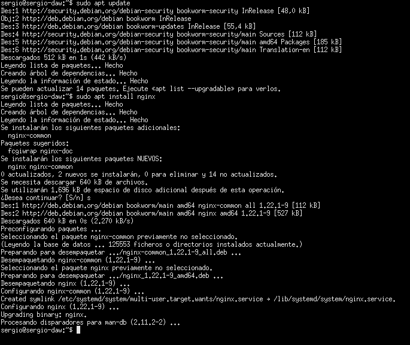
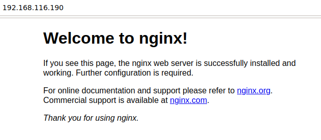
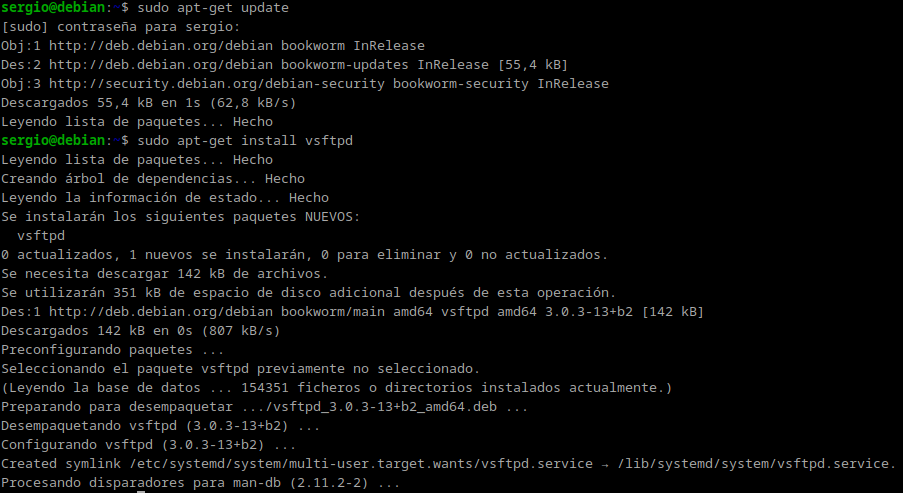
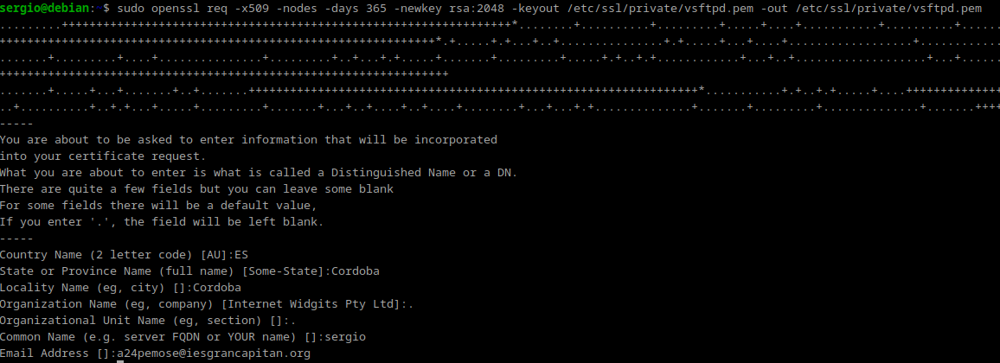
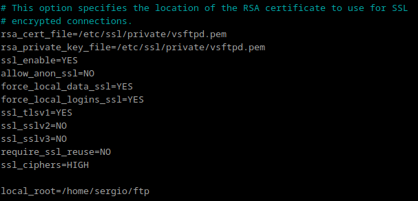
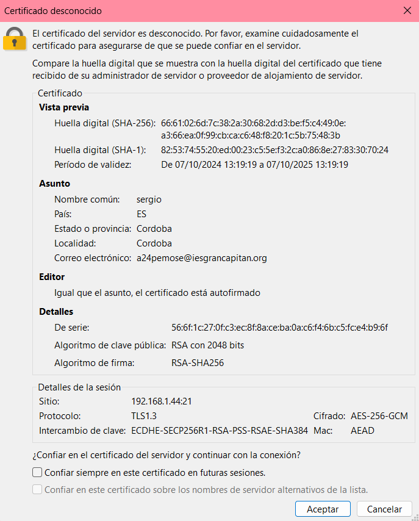
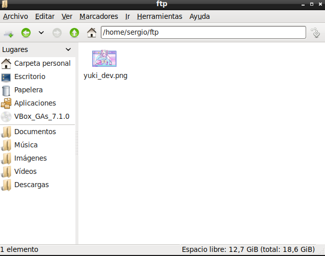
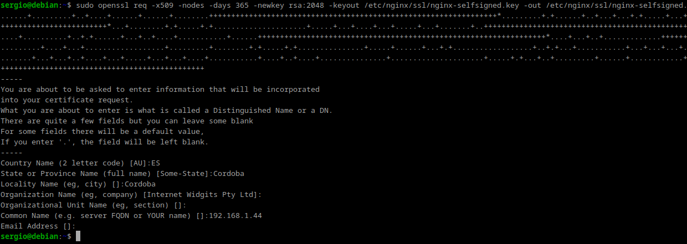

# Práctica 2,1 - Instalación y configuración de servidor web Nginx

## Instalación servidor web nginx

Primero tenemos que instalar el servidor nginx, actualizando los repositorios e instalándolo desde la consola.



## Creación de la carpeta del sitio web

Todos los archivos que forman parte del sitio web tendrán que organizarse en carpetas, que normalmente las encontramos en ***/var/www***.

Creamos el directorio sin mayor problema, y una vez creado, nos aseguramos de que tenemos git instalado para poder clonar el repositorio de github proporcionado.


Tras clonar el repositorio, haremos que el propietario de la carpeta y todo lo de dentro sera el usuario ***www-data***, utilizando los siguientes comandos.


Si todo ha salido bien, utilizando la IP de la maquina virtual, nos permitirá acceder a una web donde se muestra un mensaje



## Configuración del servidor web NGINX
En Nginx hay dos rutas importantes, tenemos ***sites-available***, la cual tiene los archivos de configuración de hosts virtuales o los bloques disponibles en el servidor. La otra es ***sites-enabled***, que contiene los archivos de configuración de los sitios habilitados.

Para que Nginx presente el contenido de nuestra propia web, tenemos que crear un bloque de servidor con todas las directivas correctas, y lo haremos modificando el archivo de configuración predeterminado, utilizando la consola.


Después, crearemos un archivo simbólico entre el archivo y el de los sitios habilitados.


Reiniciamos el servidor, para asegurarnos de que se aplica toda la nueva configuración


## Comprobaciones

<h3>Comprobación del correcto funcionamiento</h3>

Como no tenemos un servidor DNS, tendremos que hacerlo de manera manual. Para ello, tenemos que editar el archivo que se encuentra en ***/etc/hosts*** de nuestra maquina principal, añadiendo al archivo la siguiente línea


<h3>Comprobación de los registros del servidor</h3>
Para ver que todo se esta registrando correctamente en los logs, vamos a utilizar dos comandos en la consola que nos darán acceso a estos.


## FTP
Vamos a configurar el protocolo de transferencia de archivos FPT, que es una manera de transferir a través de una red TCP.

En nuestro caso, vamos a configurar un servidor SFTP, que es lo mismo pero añadiendo una capa de seguridad y privacidad al propio FTP.
<h3>Configurar servidor SFTP en Debian</h3>
Primero instalamos todo desde los siguientes repositorios.


Después creamos una carpeta en el home de Debian


Ahora tenemos que crear unos certificados de seguridad que son necesarios para aportar la capa de cifrado a la conexión. 



Ya terminados estos pasos, vamos a realizar la configuración del propio vsftpd, en mi caso he utilizado nano como editor de texto, borrando las líneas de archivo

```
rsa_cert_file=/etc/ssl/certs/ssl-cert-snakeoil.pem
rsa_private_key_file=/etc/ssl/private/ssl-cert-snakeoil.key
ssl_enable=NO
```
Para añadir otras en su lugar



Guardamos cambios del archivo, y volvemos a reiniciar para que coja la configuración nueva que hemos añadido.


Tras todo esto, ya podemos acceder al servidor, y para ello vamos a necesitar un cliente FTP, en mi caso, he descargado ***Filezilla***


Una vez instalado, podemos conectarnos de manera insegura con el puerto 21, o con el 22, en mi caso, probé primero el 21 y después el 22, introduciendo los datos necesarios para conectar al servidor.


Tras darla a conexión rápida saldrá un aviso, le daremos a aceptar sin ningún problema.



Utilizando las carpetas de la parte izquierda, nos aseguraremos de subir un archivo a la carpeta FTP del servidor, en mi caso, como prueba he subido una imagen


Para probar que todo ha ido bien, volvemos a la máquina virtual, y deberíamos tener allí el archivo transferido



## HTTPS
Vamos a añadir al servidor una capa de seguridad extra y necesaria, para obligar a nuestros sitios web a hacer uso de los certificados SSL y acceder a ellos mediante HTTPS.

Lo primero que hacemos es generar los certificados autofirmados




Y después, debemos ir al fichero de configuración del host virtual, para cambiar los parámetros de la siguiente manera, asegurándonos de que si entramos por HTTP nos redirigirá automáticamente al HTTPS


Para comprobarlo, vamos a intentar entrar en la web, y vemos que efectivamente, nos redirige a la web HTTPS.


## Cuestiones

<h3>Cuestión 1<h3>

> ¿Qué pasa si no hago el link simbólico entre `sites-available` y
> `sites-enabled` de mi sitio web?

Si no realizamos el link simbólico, no se dará de alta automáticamente nuestra configuración y no será activada, pues Nginx busca las configuraciones activas una vez están enlazadas.
<h3>Cuestión 2<h3>

> ¿Qué pasa si no le doy los permisos adecuados a `/var/www/nombre_web`?

Si no le damos los permisos adecuados, nos dará un error de acceso no autorizado cuando intentemos entrar en la página web. Básicamente, nuestra web no funcionará correctamente.

---

